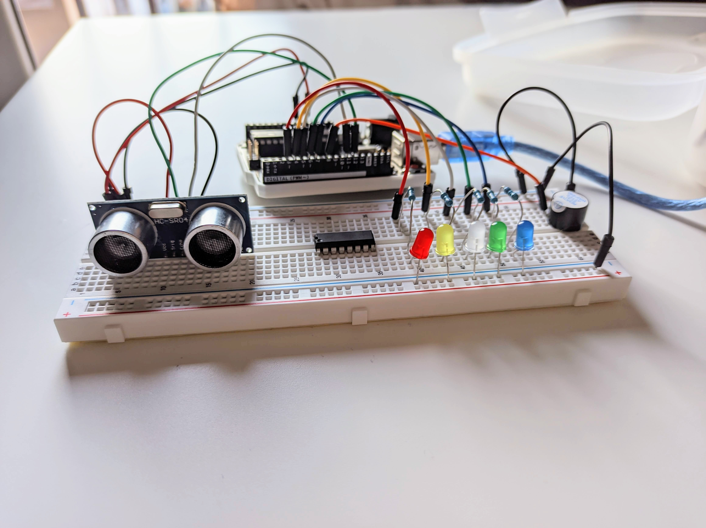
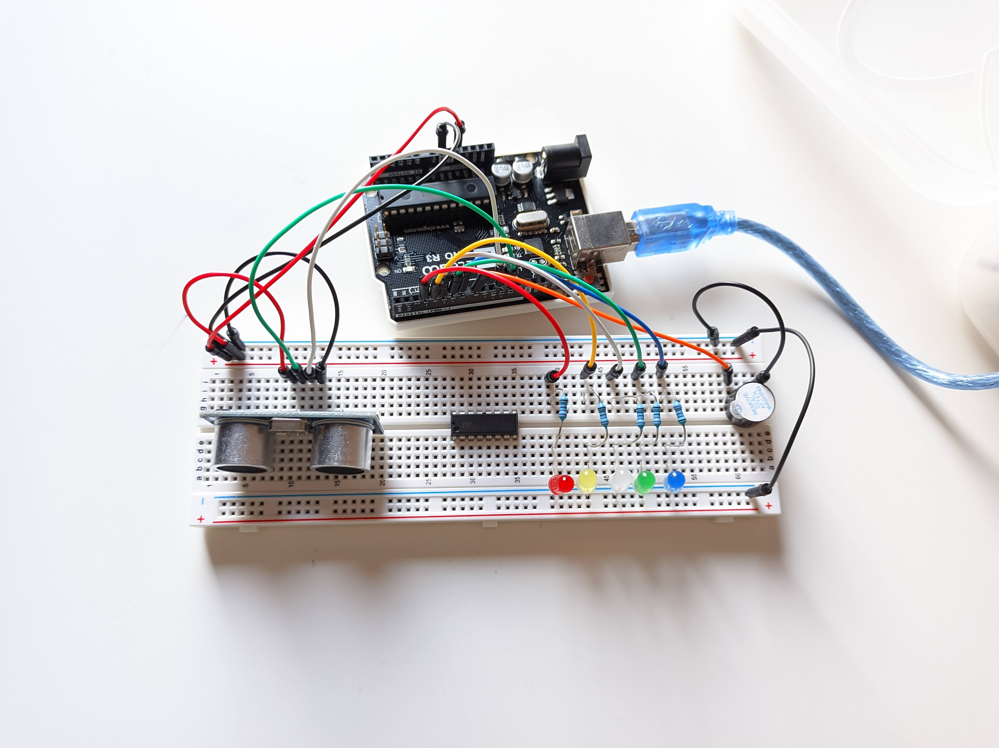
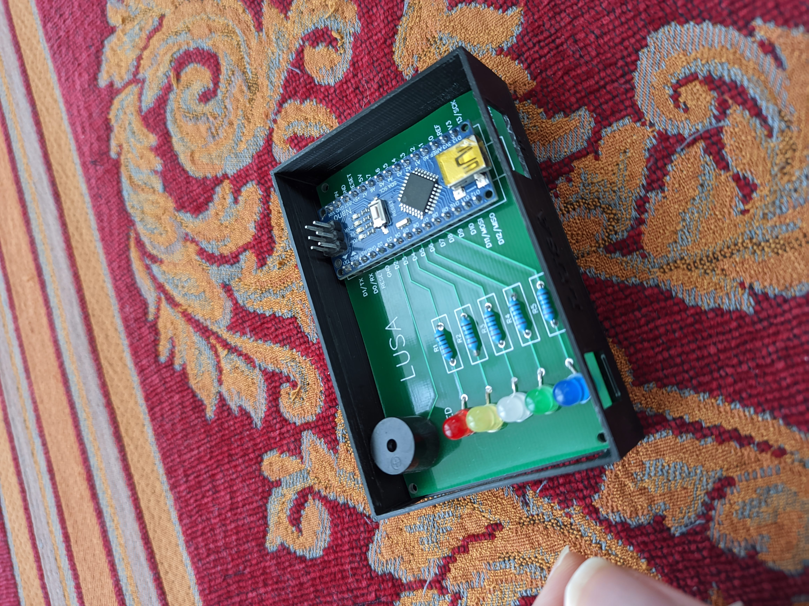
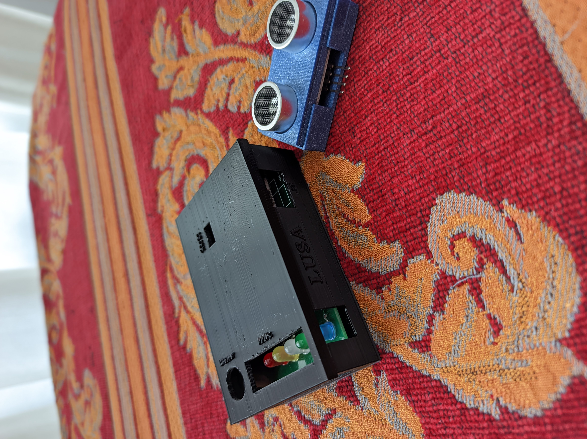

# LUSA
A DIY Arduino Nano proximity sensor for your car

## What is this?
LUSA is a begginer-friendly Arduino project which combines basic PCB designing and 3D printing to make a simple, yet useful, proximity sensor for your car. Similarly to modern cars it uses a speaker/buzzer to beep more and more if the car gets way to close to an obstacle. This project also adds some LEDs to know better how close you are!

## Which skills do I need?
The basic skills needed for doing this project yourself are:
- Basic soldering skills
- Very basic Arduino knowledge
- Knowing well your car

However, I also recommend knowing this (especially for adjusting this project for yourself, or making some slight changes to, for example, the printable parts): 
- Basic coding skills (Arduino or similar languages like C/C++)
- Basic 3D printing skills 
- Basic PCB designing 
- A bit of electronics

## What do I need for making this myself?
The parts used are:
- x5 LEDs (5 different colors)
- x5 Resistors (220 Ohms or 1K)
- x1 Active Buzzer (or similar)
- x1 Ultrasonic sensor (I used SR04)
- Arduino Nano (preferably with pins attached to it)
- The PCB in this repo (can be ordered online)
- The case for the PCB
- The case for protecting the SR04 (if you use this one)

I assume you also have:
- A PC for flashing to Arduino
- A soldering iron or soldering station
- A 3D printer (or access to a service like [Shapeways](https://shapeways.com))
- Some cables to attach the sensor to the Arduino

## Instructions
These are the steps to make LUSA yourself:
- First I recommend trying it on a breadboard to make sure your components work (especially if trying different components or adding extra features to LUSA)
- Order your PCB (I ordered mine on [JLCPCB](https://jlcpcb.com))
- If your PCB comes along with other PCBs in the same board, cut it
- Solder the components to the PCB
- Flash the program to Arduino and make sure it works
- Make sure it is cut properly, if it is too big it may not fit in the case
- Take measurements and modify case accordingly (if necessary)
- Print the case for LUSA and for the SR04
- If it fits correctly, time to solder the ultrasonic sensor (outside the case, of course)
- In my case, I soldered some male-to-female wires to the PCB, while using the female part to connect to the SR04 sensor
- Done!

The actual last step is installing LUSA in your car. In my case, I connected it to the reversing lights circuit so that LUSA only powers when going backwards. Take into account that the sensor (the one I used at least) isn't waterproof, so try to make easily detachable, in order to remove it when cleaning the car.

## Video

## Pictures

